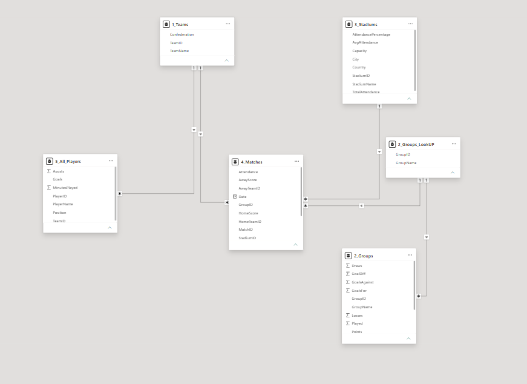
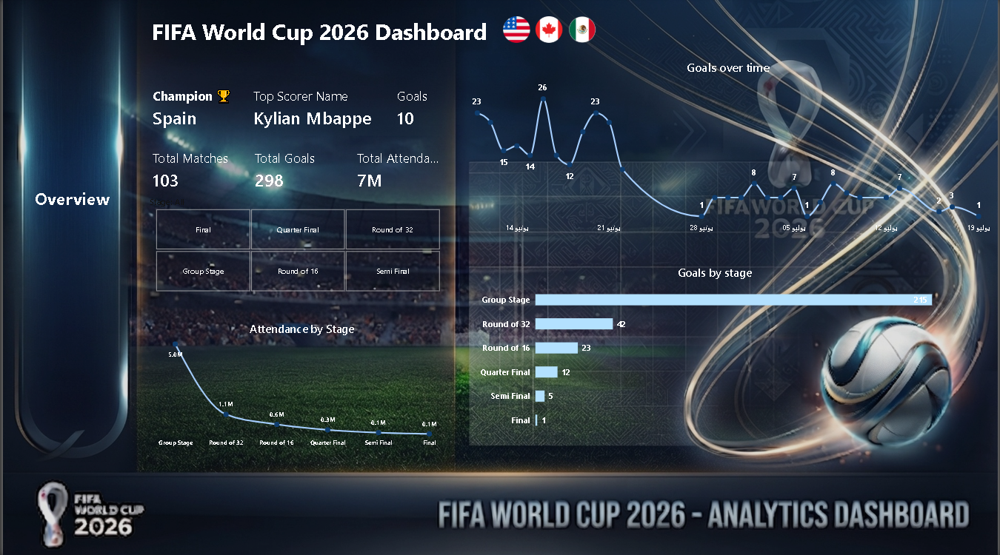
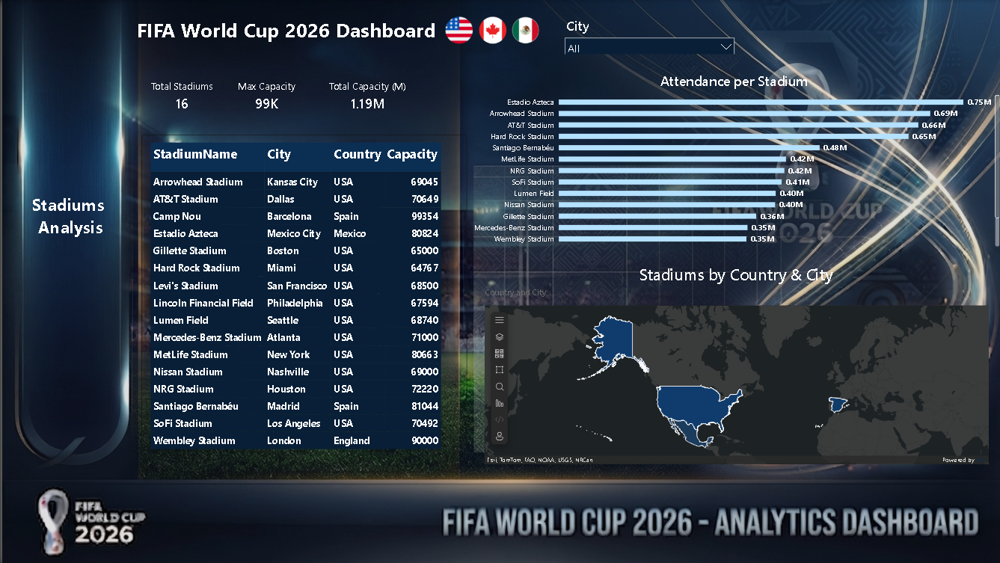
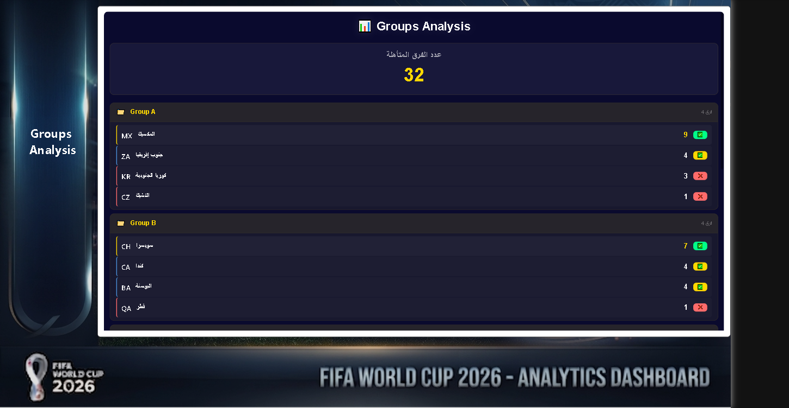
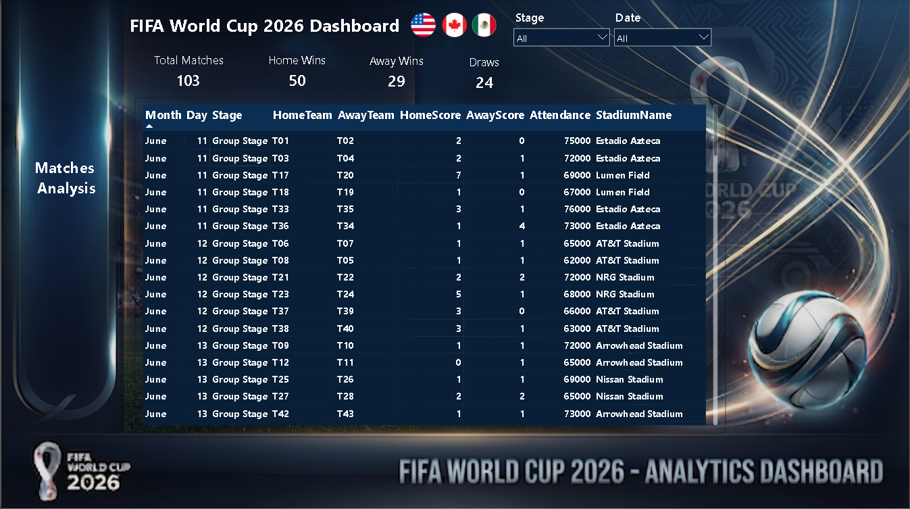
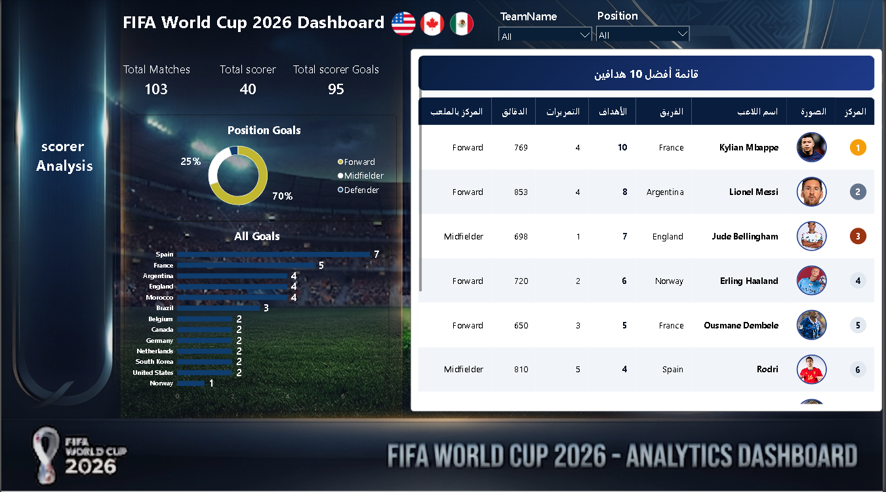

# FIFA World Cup 2026 - Analytics Dashboard ⚽ كأس العالم

A comprehensive Business Intelligence dashboard analyzing the FIFA World Cup 2026 data, built using **Power BI**.

---

## 📊 Project Overview
This project delivers a complete data analytics solution for the FIFA World Cup 2026, covering everything from high-level tournament statistics down to individual player performances, venue analysis, and group standings.

---

## 🗄️ Data Modeling & Schema
The data architecture is structured cleanly to handle relationships between teams, matches, stadiums, groups, and players using a robust relational schema:

---

## 📸 Dashboard Sections & Detailed Breakdown

### 1. Overview Page
* **Description:** Provides a high-level summary of the tournament, tracking key metrics like total matches, total goals, and overall attendance.
* **Key Highlights:** Displays tournament champion predictions and attendance trends across different stages.
* **Screenshot:**

---

### 2. Stadiums Analysis Page
* **Description:** Focuses on the infrastructure and venue distribution across host countries (USA, Canada, Mexico).
* **Key Highlights:** Features a map visualization using ArcGIS and a detailed breakdown of stadium capacities and attendance per venue.
* **Screenshot:**

---

### 3. Groups Analysis Page
* **Description:** Tracks group stage standings and qualified teams performance.
* **Key Highlights:** Monitors qualified teams count and shows detailed group-by-group metrics.
* **Screenshot:**

---

### 4. Matches Analysis Page
* **Description:** Logs match details with temporal filters (Month, Day, Stage).
* **Key Highlights:** Compares home wins, away wins, and draws alongside venue and fixture details.
* **Screenshot:**

---

### 5. scorers Analysis Page
* **Description:** Highlights individual player performances and goalscoring leaderboards.
* **Key Highlights:** Features top 10 goalscorers, position-based goal distributions, and player stats.
* **Screenshot:**

---

## 🛠️ Tools & Technologies
* **Power BI** (DAX, Power Query, Data Modeling)
* **ArcGIS Maps** for geographical visualization
* **GitHub** for version control and portfolio showcase
